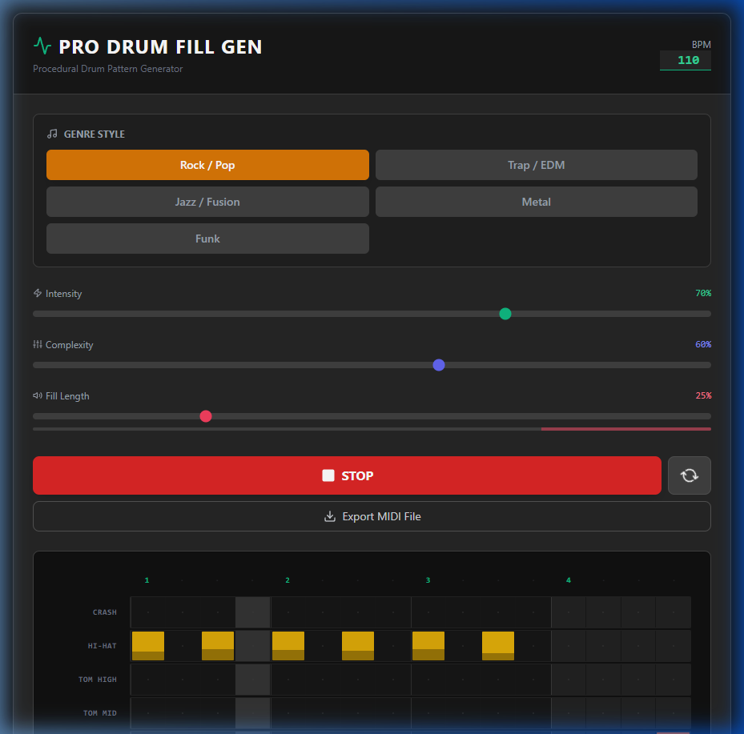

# PRO DRUM FILL GEN

A procedural drum pattern generator built with React, Vite, and Tailwind CSS. It features an interactive timeline, procedural pattern generation based on genre/complexity/intensity, and MIDI export.

## Screenshot

## Running the App

1. Ensure dependencies are installed with `npm install`
2. Run the development server with `npm run dev`
3. Navigate to `http://localhost:5173/`
